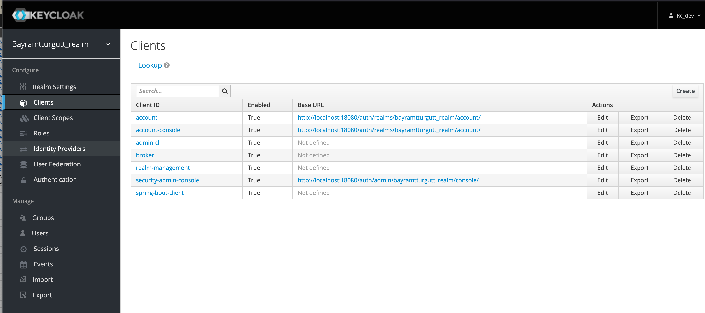
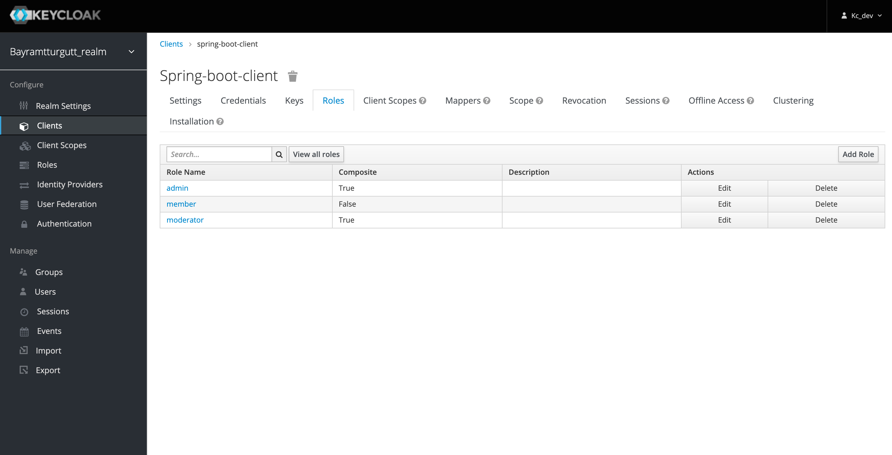

# Keycloak with Spring Boot

## What does this example show?

1. How to guard endpoints with `@RolesAllowed` & path prefix
2. Create user with Spring Boot
3. Login user and get access token with Spring Boot

---

## Table of Contents

1. [API Requirements](#api-requirements)
2. [Code Repository](#code-repository)
3. [Quick Keycloak Setup with Docker Compose](#quick-keycloak-setup-with-docker-compose)
4. [Keycloak Client Configuration](#keycloak-client-configuration)
5. [Spring Boot Application Configuration](#spring-boot-application-configuration)
6. [Guarding API with RolesAllowed](#guarding-api-with-rolesallowed)
7. [Create Account and Login Using Keycloak Admin Client](#create-account-and-login-using-keycloak-admin-client)
8. [Conclusion](#conclusion)

---

## API Requirements

- The Spring Boot API should be able to create and login users (returning an access token).
- There are three roles: `admin`, `moderator`, and `member`. Each API endpoint can be guarded by specific role requirements.
- Public endpoints do not require authentication.
- Role hierarchy:
  - `admin` > `moderator` > `member`

## Code Repository

If you want to explore the source code directly, visit the [GitHub repository](https://github.com/bayramtturgutt/Keycloak-Spring-Boot-Login).

## Quick Keycloak Setup with Docker Compose

If you don't have Keycloak installed, use the following `docker-compose.yml` file:

```yaml
version: '3'

services:
  keycloak:
    container_name: keycloak
    image: quay.io/keycloak/keycloak:15.0.2
    restart: always
    env_file: ./keycloak.env
    depends_on:
      - keycloak_db
    volumes:
      - ./bayramtturgutt_realm.json:/tmp/realm.json
    ports:
      - "18080:8080"

  keycloak_db:
    container_name: keycloak_db
    image: mariadb:10.3.26
    restart: always
    volumes:
      - keycloak_db_vol:/var/lib/mysql
    env_file:
      - ./keycloak.env

volumes:
  keycloak_db_vol:
```

### Environment Variables (`keycloak.env`)

Run Keycloak using:

```sh
docker-compose up -d
```

Once running, access Keycloak at [http://localhost:18080](http://localhost:18080).

## Keycloak Client Configuration

1. Create a new realm.
2. Add a new client (e.g., `spring-boot-client`).
3. Create roles:
   - `admin` (composite role including `moderator` and `member`)
   - `moderator` (composite role including `member`)
   - `member` (non-composite)


## Spring Boot Application Configuration

`application.properties`:

```properties
#keycloak
keycloak.realm=bayramtturgutt_realm
keycloak.auth-server-url=http://localhost:18080/auth/
#use external in production
keycloak.ssl-required=none

#name of the client
keycloak.resource=spring-boot-client
# replace with your client's secret
keycloak.credentials.secret=1a378e1c-90ce-4fa2-8f9f-f892d4975...
keycloak.use-resource-role-mappings=true
keycloak.bearer-only=true
```

## Guarding API with RolesAllowed

Example configuration:

```java
@RestController
public class HelloController {
    @GetMapping("/public/hello")
    public ResponseEntity<String> helloPublic() {
        return ResponseEntity.ok("Hello public user");
    }

    @RolesAllowed("member")
    @GetMapping("/member/hello")
    public ResponseEntity<String> helloMember() {
        return ResponseEntity.ok("Hello dear member");
    }
}
```

## Create Account and Login Using Keycloak Admin Client

To allow user creation and login via API, configure the Keycloak admin client:

```java
@Service
public class KeycloakAdminClientService {
    public Response createKeycloakUser(CreateUserRequest user) {
        UsersResource usersResource = keycloakProvider.getInstance().realm(realm).users();
        UserRepresentation kcUser = new UserRepresentation();
        kcUser.setUsername(user.getEmail());
        kcUser.setEnabled(true);
        return usersResource.create(kcUser);
    }
}
```

## Conclusion

This guide walks through setting up Keycloak with Spring Boot for authentication and authorization.
